# human_play 遊戲流程圖

```mermaid
graph TD
    START([開始人機對弈]) -->|命令行參數| PARSE["main()<br/>解析參數<br/>--config"]
    PARSE --> INIT_CTRL["GameController.__init__()<br/>初始化遊戲控制器"]
    
    INIT_CTRL --> LOAD_CFG["load_config()<br/>載入 config.json<br/>(board, human_play, network)"]
    LOAD_CFG --> SETUP_BOARD["設定棋盤<br/>width × height<br/>n_in_row = 5"]
    SETUP_BOARD --> CHECK_GPU{"GPU<br/>可用?"}
    
    CHECK_GPU -->|否且需要| ERROR1["錯誤<br/>CUDA 不可用"]
    ERROR1 --> END1([中斷])
    
    CHECK_GPU -->|是/不需要| LOAD_MODEL["加載訓練好的模型<br/>PolicyValueNet.load()<br/>← model_file"]
    LOAD_MODEL --> INIT_AI["初始化 AI 玩家<br/>MCTSPlayer<br/>(policy_value_fn,<br/>c_puct, n_playout)"]
    INIT_AI --> CREATE_GUI["創建 GUI<br/>GameGUI (Tkinter)<br/>棋盤、按鈕、信息面板"]
    CREATE_GUI --> INIT_HUMAN["初始化人類玩家<br/>GUIHumanPlayer<br/>(接收 GUI 點擊)"]
    
    INIT_HUMAN --> GET_START["讀取先手設定<br/>start_player<br/>(0=人類先, 1=AI先)"]
    GET_START --> GAME_LOOP["遊戲主循環<br/>play_game()"]
    
    GAME_LOOP --> INIT_GAME["初始化棋局<br/>board.init_board()<br/>清空棋盤"]
    INIT_GAME --> ASSIGN_PLAYER["分配玩家<br/>p1 = 人類 (黑棋)<br/>p2 = AI (白棋)"]
    ASSIGN_PLAYER --> UPDATE_GUI1["更新 GUI<br/>顯示棋盤<br/>顯示對戰信息"]
    
    UPDATE_GUI1 --> TURN_LOOP["回合循環<br/>while game_running"]
    TURN_LOOP --> GET_CURR["取得當前玩家<br/>current_player<br/>= board.get_current_player()"]
    
    GET_CURR --> IS_HUMAN{"當前是<br/>人類?"}
    
    IS_HUMAN -->|是| HUMAN_TURN["<b>人類回合</b><br/>等待 GUI 點擊"]
    HUMAN_TURN --> WAIT_CLICK["GUIHumanPlayer<br/>等待滑鼠點擊事件<br/>root.update()"]
    WAIT_CLICK --> GET_CLICK["get_action()<br/>取得點擊座標 (h, w)"]
    GET_CLICK --> VALID_MOVE{"著法<br/>合法?"}
    
    VALID_MOVE -->|否| SHOW_INVALID["顯示錯誤<br/>'Invalid move!'<br/>重新等待點擊"]
    SHOW_INVALID --> WAIT_CLICK
    VALID_MOVE -->|是| HUMAN_MOVE["返回著法 move"]
    
    IS_HUMAN -->|否| AI_TURN["<b>AI 回合</b><br/>MCTSPlayer.get_action()"]
    AI_TURN --> AI_THINK["═══════════════════<br/><b>AI 思考過程</b><br/>(MCTS + 神經網路)<br/>═══════════════════"]
    
    AI_THINK --> MCTS_INIT["初始化 MCTS 根節點<br/>root = TreeNode(parent=None)"]
    MCTS_INIT --> PLAYOUT_LOOP["MCTS 模擬循環<br/>for i in range(n_playout):"]
    
    PLAYOUT_LOOP --> PL_START["第 i 次模擬<br/>從根節點開始"]
    PL_START --> PL_SELECT["<b>1. Selection (選擇)</b><br/>while not node.is_leaf():"]
    
    PL_SELECT --> PL_CALC_UCB["計算每個子節點的 PUCT 值:<br/>PUCT = Q + c_puct × P × √(N_parent)/(1+N_node)<br/> Q: 節點平均價值<br/> P: 神經網路給的先驗概率<br/> N: 訪問次數<br/> c_puct: 探索常數"]
    PL_CALC_UCB --> PL_SELECT_MAX["選擇 PUCT 最大的子節點<br/>action, node = max(PUCT)"]
    PL_SELECT_MAX --> PL_DO_MOVE["執行著法<br/>board_copy.do_move(action)"]
    PL_DO_MOVE --> PL_CHECK_LEAF{"到達<br/>葉節點?"}
    
    PL_CHECK_LEAF -->|否| PL_SELECT
    PL_CHECK_LEAF -->|是| PL_EXPAND["<b>2. Expansion (擴展)</b><br/>檢查遊戲是否結束"]
    
    PL_EXPAND --> PL_GAME_END{"遊戲<br/>結束?"}
    PL_GAME_END -->|是| PL_TERM_VALUE["終局價值<br/>winner = {+1, -1, 0}"]
    PL_GAME_END -->|否| PL_NN_EVAL["<b>3. Evaluation (評估)</b><br/>調用神經網路<br/>policy_value_fn(board)"]
    
    PL_NN_EVAL --> NN_FORWARD["神經網路前向傳播:<br/>┌─────────────────┐<br/>輸入: 4通道特徵平面<br/>當前玩家棋子<br/>對手棋子<br/>上一步位置<br/>當前玩家標記<br/>└─────────────────┘<br/>↓ 卷積層 + ResNet塔<br/>↓"]
    
    NN_FORWARD --> NN_OUTPUT["網路輸出:<br/>┌──────────────────┐<br/>Policy Head (策略頭)<br/> → act_probs[width×height]<br/>   每個位置的下棋概率  <br/>└──────────────────┘<br/>┌──────────────────┐<br/> Value Head (價值頭) <br/> → value ∈ [-1, 1]  <br/>   當前局面勝率評估  │<br/>└──────────────────┘"]
    
    NN_OUTPUT --> PL_CREATE_CHILDREN["創建子節點<br/>for each legal_action:<br/>  child = TreeNode(prob[action])"]
    PL_CREATE_CHILDREN --> PL_BACKUP_VALUE["leaf_value = value"]
    
    PL_TERM_VALUE --> PL_BACKUP_VALUE
    PL_BACKUP_VALUE --> PL_BACKUP["<b>4. Backpropagation (回傳)</b><br/>從葉節點向上更新"]
    
    PL_BACKUP --> PL_UPDATE["遞迴更新所有祖先節點:<br/>node._n_visits += 1<br/>node._Q += (leaf_value - _Q) / _n_visits<br/>leaf_value = -leaf_value<br/>(視角切換)"]
    
    PL_UPDATE --> PL_NEXT{"完成 n_playout<br/>次模擬?"}
    PL_NEXT -->|否| PLAYOUT_LOOP
    PL_NEXT -->|是| MCTS_COMPLETE["MCTS 搜索完成<br/>根節點已訪問 n_playout 次"]
    
    MCTS_COMPLETE --> SELECT_MOVE["選擇最佳著法<br/>(temp = 1e-10, 幾乎確定性)"]
    SELECT_MOVE --> CALC_VISITS["統計根節點所有子節點訪問次數<br/>visits = [N(child) for child]"]
    CALC_VISITS --> APPLY_TEMP["應用溫度參數:<br/>probs = visits^(1/temp)<br/>temp ≈ 0 → 選訪問最多的"]
    APPLY_TEMP --> ARGMAX["move = argmax(visits)<br/>選擇訪問次數最多的著法"]
    
    ARGMAX --> AI_MOVE["返回 AI 著法 move"]
    
    HUMAN_MOVE --> EXECUTE["執行著法<br/>board.do_move(move)"]
    AI_MOVE --> UPDATE_LAST["更新 GUI<br/>顯示 AI 著法位置"]
    UPDATE_LAST --> EXECUTE
    
    EXECUTE --> UPDATE_GUI2["更新棋盤顯示<br/>gui.update_board()"]
    UPDATE_GUI2 --> CHECK_END{"遊戲<br/>結束?"}
    
    CHECK_END -->|否| CHECK_RESTART{"用戶<br/>點擊重新開始?"}
    CHECK_RESTART -->|是| RESTART_FLAG["設置 restart_requested"]
    CHECK_RESTART -->|否| TURN_LOOP
    
    CHECK_END -->|是| SHOW_RESULT["顯示結果<br/>gui.show_winner()<br/>└─ 玩家 1 勝<br/>└─ 玩家 2 勝<br/>└─ 平局"]
    
    RESTART_FLAG --> GAME_LOOP
    SHOW_RESULT --> WAIT_ACTION["等待用戶操作<br/>wait_for_restart_or_quit()"]
    
    WAIT_ACTION --> USER_CHOICE{"用戶<br/>選擇?"}
    USER_CHOICE -->|重新開始| GAME_LOOP
    USER_CHOICE -->|退出| CLEANUP["清理資源<br/>關閉 GUI"]
    CLEANUP --> NORMAL_END([正常結束])
    
    GAME_LOOP -.->|關閉視窗| FORCE_QUIT["視窗關閉"]
    FORCE_QUIT --> QUIT_END([退出])
    
    style START fill:#90EE90
    style NORMAL_END fill:#FFB6C6
    style QUIT_END fill:#FF6B6B
    style ERROR1 fill:#FF6B6B
    style AI_THINK fill:#FFE4B5
    style NN_FORWARD fill:#E6E6FA
    style NN_OUTPUT fill:#E6E6FA
    style PL_CALC_UCB fill:#E6E6FA
    style SHOW_RESULT fill:#FFD700
```



## 流程圖詳細說明

###  AI 下棋核心機制

####  **MCTS 搜索架構**

```
n_playout 次模擬 (例如: 800 次)
  │
  ├─ 每次模擬執行 4 個步驟:
  │
  ├─ [1] Selection (選擇)
  │   └─ 使用 PUCT 公式選擇最有前景的路徑
  │
  ├─ [2] Expansion (擴展)
  │   └─ 到達葉節點，準備評估
  │
  ├─ [3] Evaluation (評估)
  │   └─ 神經網路評估局面 → (策略, 價值)
  │
  └─ [4] Backpropagation (回傳)
      └─ 向上更新所有節點的統計信息
```

####  **PUCT 公式 (Predictor + UCT)**

$
PUCT(s, a) = Q(s, a) + c_{puct} \cdot P(s, a) \cdot \frac{\sqrt{N(s)}}{1 + N(s, a)}
$

**參數說明:**
- **Q(s, a)**: 在狀態 s 下選擇動作 a 的平均價值 (exploitation)
- **P(s, a)**: 神經網路給出的先驗概率 (prior)
- **N(s)**: 父節點訪問次數
- **N(s, a)**: 子節點訪問次數
- **c_puct**: 探索常數 (exploration coefficient)，控制探索強度

**公式含義:**
```
PUCT = 利用項 (已知好的) + 探索項 (未知的)
       \_____/           \_______________/
        Q(s,a)           c·P·√N/(1+n)

探索項特性:
- 訪問少的節點 (小 n) → 大加成 → 鼓勵探索
- 神經網路評分高 (大 P) → 大加成 → 信任網路
- 父節點訪問多 (大 N) → 大加成 → 全面搜索
```

####  **神經網路評估**

```
輸入: 4 通道特徵平面 (4 × width × height)
┌─────────────────────────────────┐
│ Channel 0: 當前玩家的棋子位置    │ (己方棋子 = 1)
│ Channel 1: 對手玩家的棋子位置    │ (對方棋子 = 1)
│ Channel 2: 上一步的著法位置      │ (last move = 1)
│ Channel 3: 當前玩家標記          │ (全 1 或全 0)
└─────────────────────────────────┘
         ↓
┌─────────────────────────────────┐
│ 卷積層 + ResNet 殘差塔           │
│ (num_res_blocks 個殘差塊)        │
└─────────────────────────────────┘
         ↓
    ┌────┴────┐
    ↓         ↓
┌────────┐ ┌────────┐
│Policy  │ │Value   │
│Head    │ │Head    │
└────────┘ └────────┘
    ↓         ↓
┌────────┐ ┌────────┐
│ 策略向量│ │ 價值標量│
│P[w×h]  │ │V∈[-1,1]│
│概率分布 │ │勝率評估 │
└────────┘ └────────┘
```

**輸出:**
1. **策略 (Policy)**: 每個合法位置的下棋概率分布
2. **價值 (Value)**: 當前局面的勝率評估
   - +1: 當前玩家必勝
   - -1: 當前玩家必敗
   -  0: 平局或不確定

####  **著法選擇策略**

```python
# 訓練時: 高溫度 (temp=1.0)
probs = visits ** (1/temp)  # 保留探索性
move = sample(probs)        # 隨機採樣

# 對弈時: 低溫度 (temp≈0)
probs = visits ** (1/1e-10) # → 趨近 argmax
move = argmax(visits)       # 確定性選擇
```

###  關鍵參數影響

|        參數        |  典型值   |             影響                |
|--------------------|----------|---------------------------------|
| **n_playout**      | 400-1200 | MCTS 搜索深度，越大棋力越強但越慢 |
| **c_puct**         | 2.5-5.0  | 探索強度，越大越敢嘗試新著法      |
| **num_channels**   | 128-256  | 網路容量，越大表達能力越強        |
| **num_res_blocks** | 4-6      | 網路深度，越深特徵提取越好        |

###  訓練 vs 對弈差異

|          | **訓練 (Self-Play)** | **對弈 (Human Play)** |
|----------|---------------------|----------------------|
| **溫度** | temp = 1.0 (探索)   | temp ≈ 0 (確定性)     |
| **目的** | 收集多樣化數據       | 展示最佳水平          |
| **著法** | 隨機採樣            | 選訪問最多的          |

###  AI 強度來源

1. **神經網路**: 從自我對弈中學習的模式識別
2. **MCTS**: 系統性探索未來可能性
3. **協同作用**: 
   - 網路提供直覺 (P, V)
   - MCTS 驗證並修正 (Q, N)

### 決策流程大綱

```
用戶點擊棋盤
    ↓
[如果是人類回合]
    ├─ 驗證著法合法性
    └─ 執行著法

[如果是 AI 回合]
    ├─ MCTS 搜索 n_playout 次
    │   ├─ 每次模擬:
    │   │   ├─ Selection: 用 PUCT 選路徑
    │   │   ├─ Expansion: 到達葉節點
    │   │   ├─ Evaluation: 神經網路評估
    │   │   └─ Backpropagation: 更新統計
    │   └─
    ├─ 選擇訪問最多的著法
    ├─ 執行著法
    └─ 顯示在 GUI

檢查勝負
    ├─ 繼續 → 下一回合
    └─ 結束 → 顯示結果
```

