```mermaid
graph TD
    START([開始]) -->|命令行參數| PARSE["main()<br/>解析參數:<br/>--config, --init-model"]
    PARSE --> INIT["TrainPipeline.__init__()<br/>初始化訓練管道"]
    
    INIT --> LOAD_CFG["load_config()<br/>加載 config.json<br/>(board, training, network)"]
    LOAD_CFG --> SETUP_BOARD["設定棋盤<br/>Board(width, height, n_in_row)<br/>Game(board)"]
    SETUP_BOARD --> SETUP_DYNAMIC["初始化動態參數<br/>DynamicTrainingParams<br/>├─ temp (temperature)<br/>├─ n_playout (模擬次數)<br/>└─ c_puct (探索係數)"]
    SETUP_DYNAMIC --> SETUP_PARAMS["設定訓練參數<br/>├─ learn_rate, lr_multiplier<br/>├─ buffer_size, batch_size<br/>├─ epochs, kl_targ<br/>├─ play_batch_size<br/>└─ check_freq"]
    SETUP_PARAMS --> CHECK_GPU{"GPU<br/>可用?"}
    
    CHECK_GPU -->|否| ERROR1["錯誤: CUDA 不可用<br/>RuntimeError"]
    ERROR1 --> END1([中斷])
    
    CHECK_GPU -->|是| LOAD_NET["PolicyValueNet<br/>├─ ResNet 架構<br/>├─ num_channels (128)<br/>├─ num_res_blocks (4-6)<br/>└─ 加載 init_model (可選)"]
    LOAD_NET --> INIT_MCTS["MCTSPlayer(is_selfplay=1)<br/>├─ policy_value_fn<br/>├─ c_puct (初始值)<br/>└─ n_playout (初始值)"]
    INIT_MCTS --> RUN["TrainPipeline.run()<br/>開始訓練迴圈"]
    
    RUN --> BATCH_LOOP["批次迴圈<br/>for i in range(game_batch_num)"]
    BATCH_LOOP --> UPDATE_DYN["更新動態參數<br/>get_all_params(i)<br/>├─ 更新 c_puct<br/>├─ 更新 n_playout<br/>└─ 更新 temperature"]
    UPDATE_DYN --> UPDATE_MCTS["更新 MCTS 玩家<br/>MCTSPlayer(<br/>  policy_value_fn,<br/>  c_puct=新值,<br/>  n_playout=新值,<br/>  is_selfplay=1<br/>)"]
    UPDATE_MCTS --> COLLECT["collect_selfplay_data()<br/>play_batch_size 場遊戲"]
    
    COLLECT --> SELF_PLAY["Game.start_self_play()<br/>單場自我對弈"]
    SELF_PLAY --> INIT_BOARD["Board.init_board()<br/>初始化空棋盤"]
    INIT_BOARD --> MOVE_LOOP["著法迴圈<br/>while not game_end"]
    
    MOVE_LOOP --> GET_ACTION["MCTSPlayer.get_action()<br/>├─ temp=temperature<br/>└─ return_prob=1"]
    GET_ACTION --> MCTS_SEARCH["MCTS.get_move_probs()<br/>執行 n_playout 次模擬"]
    MCTS_SEARCH --> PLAYOUT_LOOP["模擬迴圈<br/>for n in range(n_playout)"]
    
    PLAYOUT_LOOP --> SINGLE_PLAYOUT["單次模擬 _playout()<br/>├─ 從根節點開始<br/>├─ 選擇: node.select(c_puct)<br/>│  └─ 最大化 Q + u<br/>├─ 展開: node.expand()<br/>│  └─ policy_value_fn(state)<br/>│     └─ ResNet 前向傳播<br/>└─ 回傳: update_recursive()"]
    SINGLE_PLAYOUT --> PLAYOUT_END{"完成<br/>n_playout<br/>次?"}
    PLAYOUT_END -->|否| PLAYOUT_LOOP
    PLAYOUT_END -->|是| CALC_PROBS["計算訪問概率<br/>act_probs = softmax(<br/>  1/temp × log(visits)<br/>)"]
    
    CALC_PROBS --> ADD_NOISE{"is_selfplay<br/>== 1?"}
    ADD_NOISE -->|是| DIRICHLET["🎲 添加 Dirichlet 雜訊<br/>move = choice(acts,<br/>  p = 0.8×probs +<br/>      0.2×Dir(α=0.15)<br/>)<br/>└─ 增加探索多樣性"]
    ADD_NOISE -->|否| NO_NOISE["選擇最大概率著法<br/>move = choice(acts, p=probs)"]
    
    DIRICHLET --> RECORD["記錄訓練數據<br/>├─ state ← board.current_state()<br/>├─ mcts_probs ← move_probs<br/>└─ current_player"]
    NO_NOISE --> RECORD
    RECORD --> DO_MOVE["Board.do_move(move)<br/>├─ states[move] = player<br/>├─ availables.remove(move)<br/>└─ 切換玩家"]
    DO_MOVE --> CHECK_END{"game_end()?"}
    
    CHECK_END -->|否| MOVE_LOOP
    CHECK_END -->|是| ASSIGN_REWARD["分配獎勵值<br/>winners_z:<br/>├─ 勝者 +1.0<br/>├─ 敗者 -1.0<br/>└─ 平手  0.0"]
    ASSIGN_REWARD --> RETURN_DATA["返回 (winner, play_data)<br/>play_data = zip(<br/>  states,<br/>  mcts_probs,<br/>  winners_z<br/>)"]
    
    RETURN_DATA --> DATA_AUG["get_equi_data()<br/>資料增強 (8倍)"]
    DATA_AUG --> AUG_DETAIL["對每個 (state, prob, z):<br/>├─ 旋轉 4 次 (0°,90°,180°,270°)<br/>│  └─ 每次旋轉 × 翻轉 2 次<br/>└─ 生成 8 個等價樣本"]
    AUG_DETAIL --> EXTEND_BUFFER["data_buffer.extend()<br/>添加到經驗回放池<br/>(maxlen=buffer_size)"]
    
    EXTEND_BUFFER --> PRINT_INFO["打印:<br/>batch i, episode_len<br/>n_playout, c_puct, temp"]
    PRINT_INFO --> CHECK_BUFFER{"len(data_buffer)<br/>> batch_size?"}
    
    CHECK_BUFFER -->|否| SKIP_TRAIN["跳過訓練<br/>繼續收集數據"]
    CHECK_BUFFER -->|是| POLICY_UPD["policy_update()<br/>神經網路訓練"]
    
    POLICY_UPD --> SAMPLE["random.sample()<br/>採樣 batch_size 個樣本<br/>├─ state_batch<br/>├─ mcts_probs_batch<br/>└─ winner_batch"]
    SAMPLE --> GET_OLD["計算舊策略<br/>old_probs, old_v =<br/>  policy_value_net<br/>    .policy_value(state_batch)"]
    GET_OLD --> EPOCH_LOOP["訓練迴圈<br/>for i in range(epochs)"]
    
    EPOCH_LOOP --> TRAIN_STEP["train_step()<br/>├─ zero_grad()<br/>├─ set_learning_rate(<br/>│    lr × lr_multiplier)<br/>├─ 前向傳播:<br/>│  log_act_probs, value<br/>├─ 計算損失:<br/>│  value_loss = MSE(v, z)<br/>│  policy_loss = -Σ π·log(p)<br/>│  loss = value_loss<br/>│         + policy_loss<br/>├─ backward()<br/>└─ optimizer.step()"]
    TRAIN_STEP --> GET_NEW["計算新策略<br/>new_probs, new_v"]
    GET_NEW --> CALC_KL["計算 KL 散度<br/>KL = Σ old_probs ×<br/>  log(old_probs / new_probs)"]
    CALC_KL --> CHECK_KL{"KL ><br/>4×kl_targ?"}
    
    CHECK_KL -->|是| EARLY_STOP["提前停止<br/>break<br/>(避免策略變化過大)"]
    CHECK_KL -->|否| CONTINUE_EPOCH["繼續訓練"]
    EARLY_STOP --> EPOCH_END
    CONTINUE_EPOCH --> EPOCH_DONE{"完成<br/>epochs?"}
    EPOCH_DONE -->|否| EPOCH_LOOP
    EPOCH_DONE -->|是| EPOCH_END["Epochs 完成"]
    
    EPOCH_END --> ADJUST_LR["自適應學習率調整"]
    ADJUST_LR --> CHECK_KL_HI{"KL > 2×kl_targ<br/>AND<br/>lr_mult > 0.1?"}
    CHECK_KL_HI -->|是| LR_DOWN["lr_multiplier /= 1.5<br/>(降低學習率)"]
    CHECK_KL_HI -->|否| CHECK_KL_LO{"KL < kl_targ/2<br/>AND<br/>lr_mult < 10?"}
    LR_DOWN --> CHECK_KL_LO
    CHECK_KL_LO -->|是| LR_UP["lr_multiplier ×= 1.5<br/>(提高學習率)"]
    CHECK_KL_LO -->|否| CALC_EXPL
    LR_UP --> CALC_EXPL["計算可解釋方差<br/>explained_var =<br/>1 - Var(z-v) / Var(z)"]
    
    CALC_EXPL --> PRINT_STATS["打印統計:<br/>kl, lr_multiplier<br/>loss, entropy<br/>explained_var_old/new"]
    PRINT_STATS --> TRAIN_END["返回 loss, entropy"]
    
    SKIP_TRAIN --> CHECK_EVAL
    TRAIN_END --> CHECK_EVAL{"(i+1) %<br/>check_freq<br/>== 0?"}
    
    CHECK_EVAL -->|否| NEXT_BATCH
    CHECK_EVAL -->|是| EVAL["policy_evaluate()<br/>性能評估"]
    
    EVAL --> EVAL_INIT["創建評估玩家<br/>current_mcts (is_selfplay=0)<br/>pure_mcts (純 MCTS)<br/>├─ c_puct=5<br/>└─ n_playout=設定值"]
    EVAL_INIT --> EVAL_GAMES["對局 n_games 場<br/>start_play()<br/>├─ 交替先手<br/>└─ 無雜訊 (確定性)"]
    EVAL_GAMES --> CALC_WIN["計算勝率<br/>win_ratio =<br/>(win + 0.5×tie) / n_games"]
    CALC_WIN --> SAVE_CUR["保存當前模型<br/>→ current_policy.model"]
    
    SAVE_CUR --> CHECK_BEST{"win_ratio ><br/>best_win_ratio?"}
    
    CHECK_BEST -->|是| SAVE_BEST["🏆 新最佳模型!<br/>best_win_ratio = win_ratio<br/>保存 → best_policy.model"]
    CHECK_BEST -->|否| NOT_BEST["保持舊的 best_policy"]
    SAVE_BEST --> CHECK_PERFECT{"best_win_ratio<br/>== 1.0 AND<br/>playout < 5000?"}
    NOT_BEST --> NEXT_BATCH
    
    CHECK_PERFECT -->|是| UP_DIFFICULTY["提升評估難度<br/>pure_mcts_playout += 1000<br/>best_win_ratio = 0.0<br/>(重新挑戰)"]
    CHECK_PERFECT -->|否| NEXT_BATCH
    UP_DIFFICULTY --> NEXT_BATCH
    
    NEXT_BATCH{"i < game_batch_num<br/>- 1?"}
    
    NEXT_BATCH -->|是| BATCH_LOOP
    NEXT_BATCH -->|否| SUCCESS["✓ 訓練完成<br/>best_policy.model"]
    SUCCESS --> NORMAL_END([正常結束])
    
    BATCH_LOOP -.->|KeyboardInterrupt| INTERRUPT["捕獲 Ctrl+C"]
    INTERRUPT --> QUIT["print('quit')"]
    QUIT --> QUIT_END([中斷結束])
    
    style START fill:#90EE90
    style NORMAL_END fill:#FFB6C6
    style QUIT_END fill:#FF6B6B
    style ERROR1 fill:#FF6B6B
    style EARLY_STOP fill:#FFE4B5
    style SAVE_BEST fill:#FFD700
    style UP_DIFFICULTY fill:#87CEEB
    style DIRICHLET fill:#FFB6C1
    style SINGLE_PLAYOUT fill:#E6E6FA
    style AUG_DETAIL fill:#E6E6FA
    style EVAL_GAMES fill:#E6E6FA
    style TRAIN_STEP fill:#F0E68C
```

## 流程圖詳細說明

### 🔴 主要階段

####  **初始化階段** (START → RUN)
```
├─ 解析命令行參數
├─ 加載 config.json
├─ 設定棋盤參數
├─ 檢查 GPU 可用性
├─ 加載神經網路 (ResNet)
└─ 初始化 MCTS 玩家
```

####  **自我對弈資料收集** (collect_selfplay_data)
```
play_batch_size 場遊戲:
├─ 初始化棋盤
├─ 循環執行著法 (直到遊戲結束):
│  ├─ MCTS: n_playout 次模擬搜索
│  ├─ 著法選擇: temperature=temp
│  ├─ 記錄: (state, mcts_prob)
│  └─ 執行著法
├─ 返回: (winner, play_data)
└─ 儲存 episode_len
```

####  **資料增強** (get_equi_data)
```
對每局棋:
├─ 旋轉 4 次 (0°, 90°, 180°, 270°)
└─ 對每個旋轉做翻轉 (2 次)
   └─ 生成 8 倍等價棋局
```

####  **網路訓練** (policy_update)
```
if data_buffer.size > batch_size:
  ├─ 隨機採樣 mini_batch
  ├─ 計算舊策略 (old_probs, old_v)
  ├─ 訓練迴圈 (epochs 次):
  │  ├─ 前向傳播
  │  ├─ 計算損失: L = L_policy + L_value
  │  ├─ 反向傳播 + 優化
  │  ├─ 計算新策略 (new_probs, new_v)
  │  ├─ 計算 KL 散度
  │  └─ if KL > 4×target: break (提前停止)
  │
  ├─ 動態學習率調整:
  │  ├─ if KL > 2×target: lr_multiplier /= 1.5 (降速)
  │  └─ if KL < target/2: lr_multiplier ×= 1.5 (加速)
  │
  └─ 打印統計信息
```

####  **定期評估** (policy_evaluate)
```
if (i+1) % check_freq == 0:
  ├─ 執行 n_games 場評估遊戲
  ├─ 對手: Pure MCTS (N=pure_mcts_playout_num)
  ├─ 計算勝率
  ├─ 保存 current_policy.model
  │
  └─ if win_ratio > best_win_ratio:
     ├─ 保存 best_policy.model (新最佳)
     └─ if win_ratio == 100%:
        └─ 提高難度: pure_mcts_playout_num += 1000
```

###  關鍵變數追蹤

|            變數             |                 用途              |
|-----------------------------|-----------------------------------|
| **data_buffer**             | 儲存自我對弈資料 (最多 buffer_size) |
| **lr_multiplier**           | 動態學習率倍數 (範圍: 0.1~10)       |
| **best_win_ratio**          | 追蹤最佳模型性能                    |
| **episode_len**             | 每場遊戲的步數                      |
| **pure_mcts_playout_num**   | 評估難度 (逐漸增加)                 |

###  性能最佳化點

1. **早期停止 (Early Stopping)**
   ```python
   if kl > self.kl_targ * 4:
       break  # 避免過度訓練
   ```

2. **自適應學習率**
   ```python
   if kl > 2×target:
       lr_multiplier /= 1.5  # 太快降速
   elif kl < target/2:
       lr_multiplier *= 1.5  # 太慢加速
   ```

3. **漸進式難度提升**
   ```python
   if win_ratio == 1.0 and playout < 5000:
       pure_mcts_playout_num += 1000  # 邪惡難度
   ```

###  決策邏輯

```
訓練流程決策樹:

START
  ↓
批次 i (0 to game_batch_num-1)
  ├─ 收集 play_batch_size 場自我對弈
  ├─ 資料增強 (8×擴展)
  ├─ buffer 足夠? → 訓練網路
  │  └─ KL 監控 & 學習率調整
  │
  └─ 每 check_freq 批:
     ├─ 評估 vs Pure MCTS
     ├─ 超越最佳? → 保存新最佳
     └─ 100% 勝率? → 提高 Pure MCTS 難度(self play MCTS模擬次數 +1000)
       └─ 重置評估 (繼續進步)
```

###  中斷處理

```
try:
  執行訓練迴圈
except KeyboardInterrupt:
  print('quit')  # (Ctrl+C)
```
